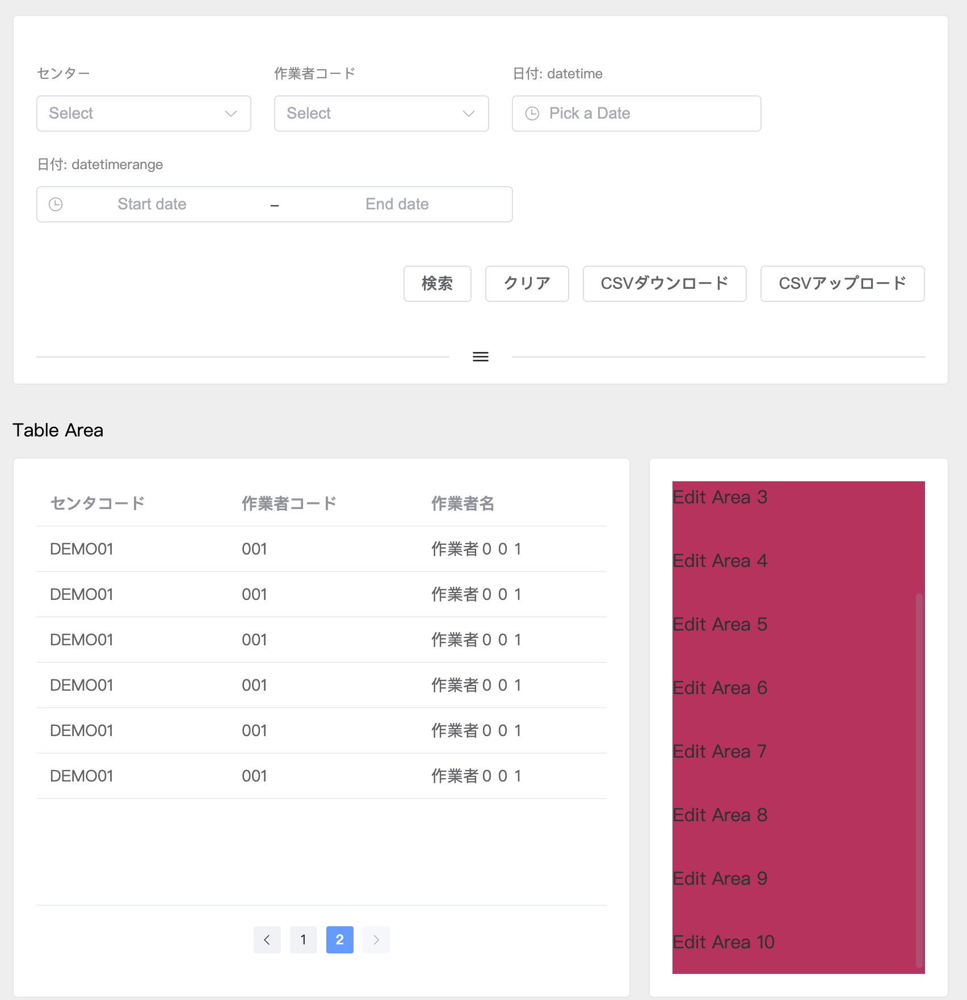

### 项目的资源地址

**仓库地址:**
```s
https://gitee.com/jch1011/vue3_admin_template-bj1.git
```

<br>

### 接口文档:
**真实服务器域名:** 
```s
http://sph-api.atguigu.cn
```

<br>

**swagger文档:**  
项目在线文档
```s
http://139.198.104.58:8209/swagger-ui.html

http://139.198.104.58:8212/swagger-ui.html#/
```

<br>

**echarts:国内镜像网站**
```s
https://www.isqqw.com/echarts-doc/zh/option.html#title
http://datav.aliyun.com/portal/school/atlas/area_selector
```

<br><br>

## AppExpandPanel:
基于 el-collapse 进行的封装, 提供了默认插槽用于存放折叠面板中需要展示的内容

<br>

### Path：
```s
/src/components/AppExpandPanel.vue
```

<br>

### Example:
```html
<script setup lang="ts">
import AppExpandPanel from '../components/AppExpandPanel.vue'
import SearchArea from './SearchArea.vue'

defineOptions({
  name: 'WorkerMaster'
})

// ----- methods -----

// ----- lifecycle ------
</script>

<template>
  <div class="worker-container">
    <!-- 折り畳み コンポーネント -->
    <AppExpandPanel>
      <SearchArea />
    </AppExpandPanel>
  </div>
</template>

<style scoped lang="scss"></style>
```


<br><br>

## AppTableContainer:
AppTableContainer可以动态的调整 **表格** 和 **編集エリア** 和 **新規エリア** 的高度, **并且内部提供了插槽, 只需要将对应的结构放入到对应的插槽中即可**

<br>

### AppTableContainer Attributes
|属性名|详情|类型|默认值|
|:--|:--|:--|:--|
|captionText|<font color='#C2185B'>必传</font>, 表格标题的文本|string|''|
|hasPagination|<font color='#C2185B'>可选</font>, 是否展示pagination|boolean|false|
|paginationForm|<font color='#C2185B'>可选</font>, pagination所需要的数据, 包含 {pageNo: number, pageSize: number, total: number}|object|{pageNo: 1, pageSize: 5, total: 0}|
|editAreaVisiable|<font color='#C2185B'>可选</font>, 控制 編集エリア 和 新規エリア 显示和隐藏的变量, 包含 {edit: boolean, add: boolean}|object|{edit: false, add: false}|

<br>

### AppTableContainer Events
|事件名|说明|回调参数|
|:--|:--|:--|
|changeCurrentPage|当切换页码时的回调|pageNo|

<br>

### AppTableContainer Slots
|插槽名|描述|作用域参数|
|:--|:--|:--|
|tableArea|用于存放 table 区域| { height }, 表格的高度|
|addArea|用于存放 新规 区域||
|editArea|用于存放 编辑 区域||

<br>

### Example:
```html
<script setup lang="ts">
import { reactive } from 'vue'

import AppTableContainer from '../components/AppTableContainer.vue'

defineOptions({
  name: 'WorkerMaster'
})

// ----- variable -----
type tableItemDataType = {
  centerCode: string
  wokerCode: string
  wokerName: string
}
const tableData = reactive<tableItemDataType[]>([
  {
    centerCode: 'DEMO01',
    wokerCode: '001',
    wokerName: '作業者００１'
  },
  {
    centerCode: 'DEMO01',
    wokerCode: '001',
    wokerName: '作業者００１'
  },
  {
    centerCode: 'DEMO01',
    wokerCode: '001',
    wokerName: '作業者００１'
  },
  {
    centerCode: 'DEMO01',
    wokerCode: '001',
    wokerName: '作業者００１'
  },
  {
    centerCode: 'DEMO01',
    wokerCode: '001',
    wokerName: '作業者００１'
  },
  {
    centerCode: 'DEMO01',
    wokerCode: '001',
    wokerName: '作業者００１'
  }
])

type paginationFormType = {
  pageSize?: number
  pageNo?: number
  total?: number
}
const pageForm = reactive<paginationFormType>({
  pageSize: 3,
  pageNo: 2,
  total: tableData.length
})

type editAreaVisiableType = {
  edit: boolean
  add: boolean
}
const editAreaVisiable = reactive<editAreaVisiableType>({
  edit: false,
  add: false
})

// ----- methods -----
const changeCurrentPageHandler = (pageNo: number): void => {
  console.log('changeCurrentPageHandler', pageNo)
  pageForm.pageNo = pageNo
}

const rowClickHandler = (row: tableItemDataType) => {
  console.log(row)
  // 展示: editArea 区域
  editAreaVisiable.add = !editAreaVisiable.add
  console.log(editAreaVisiable)
}

// ----- lifecycle ------
</script>

<template>
  <div class="worker-container">

    <!-- テーブルコンテナ コンポーネント -->
    <AppTableContainer
      captionText="Table Area"
      :has-pagination="true"
      :pagination-form="pageForm"
      :edit-area-visiable="editAreaVisiable"
      @change-current-page="changeCurrentPageHandler"
    >
      <!-- Slot: Table エリア -->
      <template #tableArea="{ height }">
        <el-table
          :data="tableData"
          :height="height"
          @row-click="rowClickHandler"
        >
          <el-table-column prop="centerCode" label="センタコード" />
          <el-table-column prop="wokerCode" label="作業者コード" />
          <el-table-column prop="wokerName" label="作業者名" />
        </el-table>
      </template>

      <!-- Slot: 編集エリア -->
      <template #editArea>
        <div v-for="num in 10" :key="num" class="worker-master-edit-area">
          Edit Area {{ num }}
        </div>
      </template>

    </AppTableContainer>
  </div>
</template>

<style scoped lang="scss">
.worker-container {
  height: 100%;
  font-size: 16px;

  .worker-master {
    &-edit-area {
      background-color: #c2185b;
      padding: 20px 0px;
    }
  }
}
</style>
```


